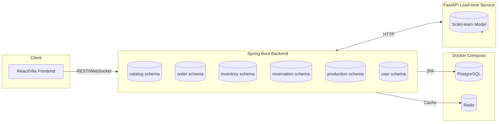
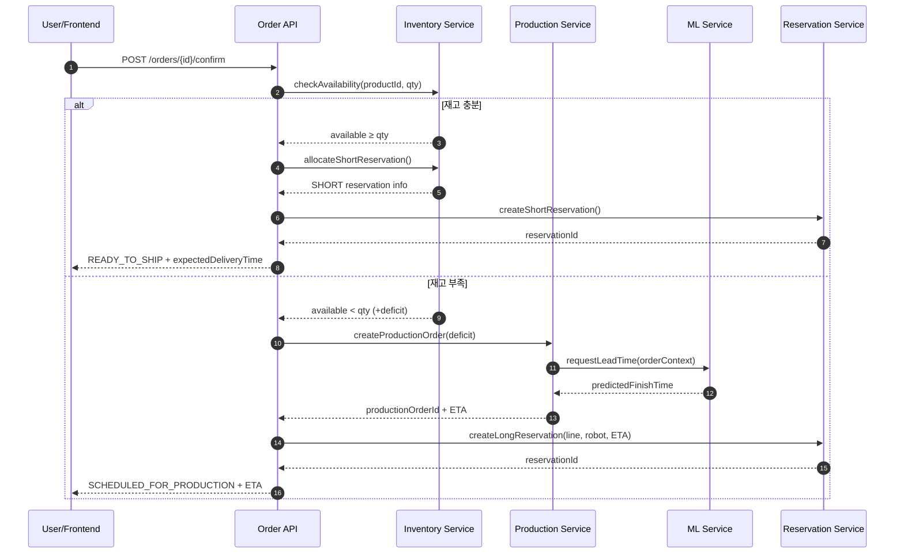

## 🌊 해저 스마트 공장 디지털 Twin PoC
**예약 기반 주문 · 생산 오케스트레이션 · ML 납기 예측**

> 해저 채굴 → 가공 → 조립 → 검사 → 출하까지 이어지는 무인 스마트팩토리를 디지털 트윈으로 구현한 포트폴리오형 PoC. e-Commerce · MES · 로봇 제어 · ML을 하나의 파이프라인으로 엮어 “주문 수용 판단 → 재고/생산 연계 → 예약 기반 슬롯 관리 → 납기 확정”을 증명합니다.

---

## 🎯 프로젝트 핵심 가치
| Value | 설명 |
| --- | --- |
| **멀티 스키마 모노리스** | catalog/order/inventory/reservation/production/user 스키마 분리, DB 레벨 경계 유지 |
| **예약 기반 오케스트레이션** | 재고 즉시 출하(SHORT) vs 생산 예약(LONG) 자동 분기 |
| **ML 연동 납기 예측** | FastAPI + Scikit-learn으로 생산 리드타임 예측 후 주문 납기 확정 |
| **디지털 트윈 UI** | 해저 시설·로봇 이동·생산 타임라인을 WebSocket/SSE로 생동감 있게 표현 |

---

## 🧩 전체 아키텍처
```text
frontend/     React + Vite + TypeScript
backend/      Spring Boot + JPA + WebSocket
  ├─ catalog       (schema: catalog)
  ├─ order         (schema: order)
  ├─ inventory     (schema: inventory)
  ├─ reservation   (schema: reservation)
  ├─ production    (schema: production)
  └─ user          (schema: user)
ml-service/   FastAPI + Scikit-learn (lead-time)
infra/        Docker Compose + PostgreSQL + Redis
```

- 단일 DB 안에서 스키마=도메인 1:1 매핑 → FK 대신 ID 참조로 느슨한 결합
- 모듈 경계가 MSA 전환 시 자연스럽게 서비스 경계가 됨

#### 🗺 Mermaid Architecture Diagram


---

## 🧱 도메인 모델 한눈에 보기
| 도메인 | 주요 엔티티 | 핵심 책임 |
| --- | --- | --- |
| **Catalog** | `Product`, `Bom` | RAW/PART/FINAL 제품, BOM 구성 정의 |
| **Inventory** | `InventoryItem` | 가용수량/안전재고, NORMAL/LOW/OUT 상태 계산 |
| **Order** | `Order` | PENDING → READY_TO_SHIP / SCHEDULED 상태 전이 |
| **Reservation** | `ReservationSlot` | SHORT(즉시 출하) / LONG(생산 슬롯) 예약 |
| **Production** | `ProductionOrder`, `Task` | 부족 수량 생산 지시, 작업 상태 추적 |
| **User** | `UserAccount` | 오퍼레이터 인증/권한 |

---

## 🔄 주문·생산 풀필먼트 플로우
1. **상품 선택** → Catalog 스키마에서 제품/리드타임 조회
2. **주문 생성 (PENDING)** → Order 스키마 기록
3. **재고 확인** → Inventory 가용/안전재고 비교
4. **재고 충분** → 재고 차감 + SHORT 예약, 주문 `READY_TO_SHIP`
5. **재고 부족** → ProductionOrder 생성, ML 리드타임 예측 호출
6. **생산 시간 예측** → FastAPI 모델이 예상 완료 시간 반환
7. **예약 생성** → LONG 예약으로 라인/로봇 슬롯 확보
8. **납기 확정** → 예측 시간 기반 고객 응답, 주문 `SCHEDULED_FOR_PRODUCTION`

> 프론트·백엔드·ML·인프라가 한 줄기 파이프라인으로 이어지는 핵심 스토리입니다.

#### Mermaid Flowchart
```mermaid
flowchart TD
    A[상품 선택] --> B[주문 생성 (PENDING)]
    B --> C{Inventory 가용 재고 ≥ 수량?}
    C -- 예 --> D[재고 차감 & SHORT 예약]
    D --> E[주문 READY_TO_SHIP]
    E --> F[납기 확정/출하 준비]
    C -- 아니오 --> G[부족 수량 계산]
    G --> H[ProductionOrder 생성]
    H --> I[ML 리드타임 예측]
    I --> J[LONG 예약 (라인/로봇)]
    J --> K[주문 SCHEDULED_FOR_PRODUCTION]
    K --> F
```

### Confirm Order API 시나리오
| 구분 | 내용 |
| --- | --- |
| **입력** | `productId`, `quantity` |
| **로직** | 1) Inventory 가용 재고 조회<br>2) `available ≥ quantity` → 재고 차감, SHORT 예약, 주문 `READY_TO_SHIP`<br>3) `available < quantity` → 부족 수량 산출, ProductionOrder 생성, ML 예측, LONG 예약, 주문 `SCHEDULED_FOR_PRODUCTION` |
| **출력** | `status` (READY_TO_SHIP / SCHEDULED_FOR_PRODUCTION)<br>`expectedDeliveryTime`<br>`reservationId`, `allocationType (SHORT|LONG)` |

#### 📡 Confirm Order Sequence Diagram


---

## 🤖 디지털 트윈 구성 요소
- **시설**: 해저 채굴 구역 · 자동 생산 라인 · 품질 검사 · 출하 대기장
- **로봇**:
  - `ROV-Carrier`: 자재/반제품 운반
  - `ARM-Loader`: 설비 투입·회수
  - `ROV-Inspector`: 품질 검사/상태 모니터링
- **시각화**: WebSocket/SSE 기반 KPI, 로봇 경로, 생산 타임라인 실시간 표시

---

## 🧠 ML 서비스
| 범위 | 설명 |
| --- | --- |
| **현재** | 리드타임 예측 모델 (입력: 제품 유형/수량/공정 스펙/라인 부하 → 출력: 예상 완료 시간) |
| **연계** | 주문 납기 계산 로직과 직접 연결, Confirm Order API 응답에 반영 |
| **확장 로드맵** | 설비 이상 감지, 예지 정비, 생산 라인 밸런싱 |

---

## 🛠 기술 스택
| 영역 | 사용 기술 |
| --- | --- |
| **Frontend** | React 18, TypeScript, Vite, Zustand, TanStack Query, shadcn/ui, Tailwind CSS, React Flow, ECharts, WebSocket/SSE |
| **Backend** | Spring Boot 3.x, Spring Data JPA, Spring Security + JWT, SpringDoc OpenAPI, Redis, Kafka(확장) |
| **ML** | FastAPI, Scikit-learn, Pandas, Joblib |
| **Infra** | Docker, Docker Compose, GitHub Actions, Prometheus & Grafana(옵션) |

---

## 🚀 실행 방법
```bash
# 전체 서비스 기동
docker-compose -f infra/docker-compose.yml up --build

# 개별 서비스
docker-compose -f infra/docker-compose.yml up backend
docker-compose -f infra/docker-compose.yml up frontend
docker-compose -f infra/docker-compose.yml up ml-service
```

### 요구사항
- Docker 20.10+
- Docker Compose 2.0+
- Node.js 18+
- JDK 17+
- Python 3.9+

---

## 🗺 로드맵
1. 생산 완료 이벤트 기반 출하 자동 생성 (Kafka)
2. 로봇 경로 최적화 시뮬레이션 및 시각화 고도화
3. 설비 메트릭 수집 → Grafana 대시보드화
4. ML 모델 확장: 이상 감지, 라인 부하 예측
